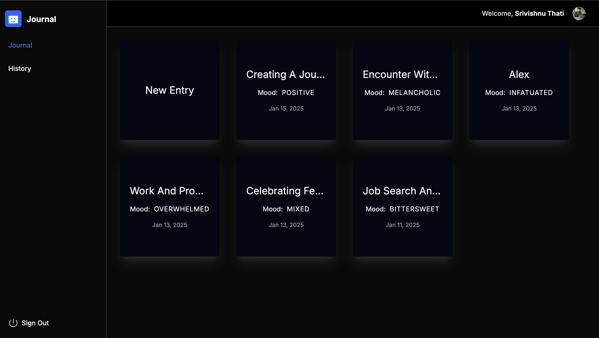
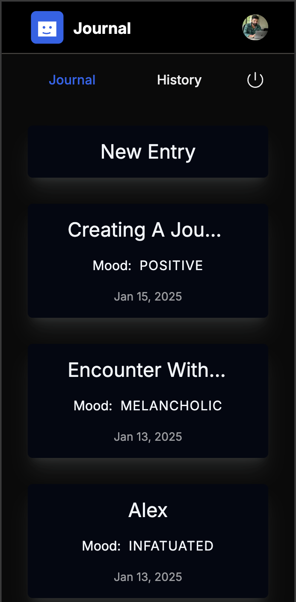
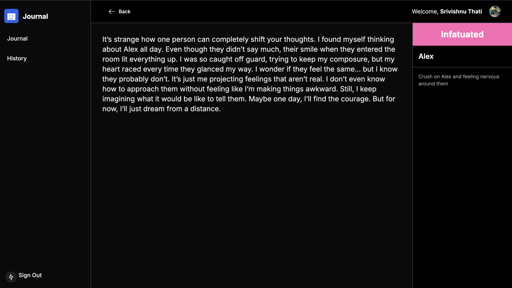
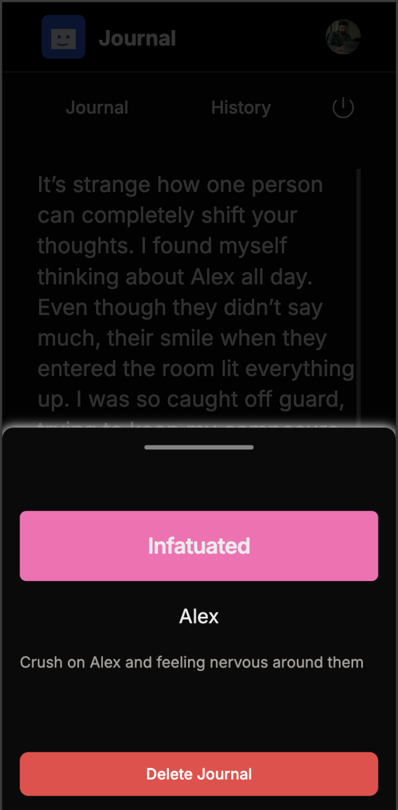

# Journal App

Welcome to the Journal App, an AI-powered journaling application that helps you track your thoughts, analyze moods, and gain insights for better mental well-being.

## Features

- **User Authentication**: Secure login with various providers.
- **Journal Entries**: Create, update, and delete journal entries.
- **Mood Analysis**: AI-driven analysis of journal entries to provide insights on mood and sentiment.
- **History Tracking**: Visual representation of mood trends over time.
- **Responsive Design**: Optimized for both desktop and mobile devices.

## Previews

Here are some previews of the Journal App:

### Home Page




### Journal Page




## Getting Started

### Prerequisites

- Node.js (version 22 or later)
- npm or yarn
- A database (e.g., PostgreSQL) and Prisma for ORM

### Installation

1. Clone the repository:

   ```bash
   git clone https://github.com/srivishnu25/journal.git
   cd journal-app
   ```

2. Install dependencies:

   ```bash
   npm install
   # or
   yarn install
   ```

3. Set up your environment variables. Create a `.env.local` file in the root directory and add your authentication credentials and database connection string:

   ```env
   AUTH_GITHUB_ID=your_github_id
   AUTH_GITHUB_SECRET=your_github_secret
   AUTH_GOOGLE_ID=your_google_id
   AUTH_GOOGLE_SECRET=your_google_secret
   DATABASE_URL=your_database_url
   GROQ_API_KEY=your_groq_api_key
   OPENAI_API_KEY=your_openai_api_key
   ```

4. Run the database migrations:

   ```bash
   npx prisma migrate dev
   ```

5. Start the development server:

   ```bash
   npm run dev
   # or
   yarn dev
   ```

6. Open your browser and navigate to [http://localhost:3000](http://localhost:3000) to see the app in action.

## Usage

- **Creating a Journal Entry**: Navigate to the journal section and click on "New Entry" to start writing.
- **Viewing History**: Access the history page to see your mood trends over time.
- **AI Analysis**: After saving an entry, the app will automatically analyze the content and provide insights.

## Learn More

For more information on Next.js, check out the [Next.js Documentation](https://nextjs.org/docs).

## Contributing

Contributions are welcome! Please open an issue or submit a pull request for any enhancements or bug fixes.

## License

This project is licensed under the MIT License.
